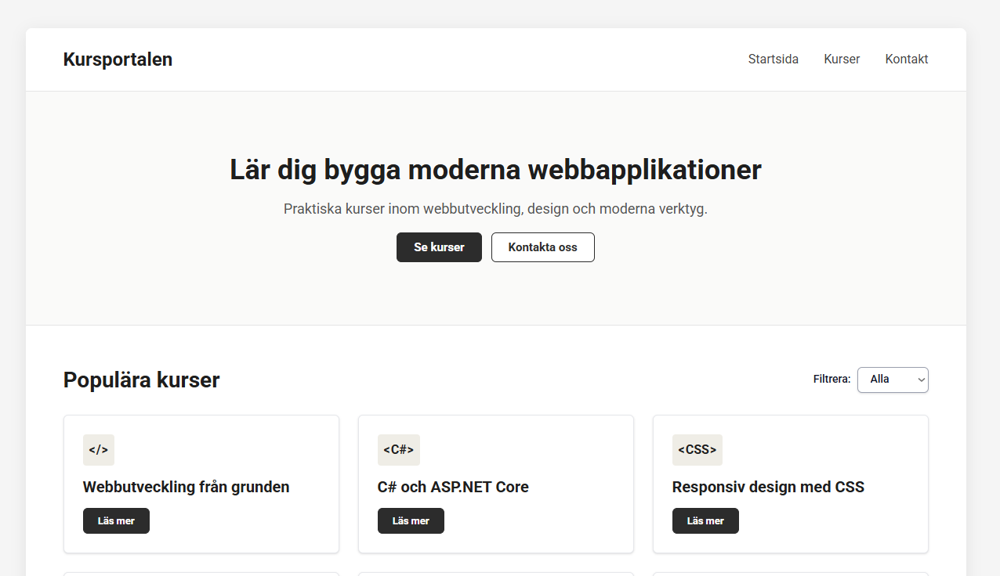

# Kursportalen



## Project Purpose
The purpose of this project is to build a responsive course portal web application for an educational institution or bootcamp using modern web technologies. The application provides an interactive platform featuring a comprehensive start page with a hero section, dynamic course lists with filtering capabilities, detailed course views loaded from JSON, and a contact section with validation.

## Core Technologies
* **React & TypeScript:** Component-driven user interface architecture with strongly typed data structures.
* **Tailwind CSS:** Utility-first styling pipeline for rapid and consistent responsive design.
* **Vite:** High-performance local development build tool providing Hot Module Replacement (HMR) and production asset bundling.
* **HTML5 Semantics & WCAG:** Accessible document structure using semantic landmarks (`header`, `main`, `section`, `article`, `nav`, `footer`) and accessibility compliance.

## Project Structure
The project source code lives in the `src/` directory, while static files and data are stored in `public/`.

```text
/root
 ├── dist/                  # Generated upon production build (tracked in .gitignore)
 ├── node_modules/          # Installed npm packages and dependencies
 ├── public/                # Static assets copied directly to dist root
 │   ├── data/              # JSON data files
 │   │   ├── courseCards.json
 │   │   ├── footerNavigation.json
 │   │   └── headerNavigation.json
 │   ├── favicon.svg
 │   ├── icons.svg
 │   └── robots.txt
 ├── src/                   # Source files (Vite root directory)
 │   ├── assets/            # Main project assets
 │   │   ├── react.svg
 │   │   └── vite.svg
 │   ├── components/        # React components (Modals, Cards, Forms, Navigation)
 │   │   ├── CardModal.tsx
 │   │   ├── ContactForm.tsx
 │   │   ├── CourseCard.tsx
 │   │   ├── CourseCards.tsx
 │   │   ├── CourseCategory.tsx
 │   │   ├── Footer.tsx
 │   │   ├── FooterNav.tsx
 │   │   ├── FormModal.tsx
 │   │   ├── Header.tsx
 │   │   ├── HeaderNav.tsx
 │   │   ├── InfoSection.tsx
 │   │   ├── NewCourseView.tsx
 │   │   └── PrimaryButton.tsx
 │   ├── utils/             # Utility functions (Validation, Date formatting, Scrolling)
 │   │   ├── FormValidation.ts
 │   │   ├── getFutureDate.ts
 │   │   └── scroll.ts
 │   ├── App.tsx            # Main application root component
 │   ├── index.css          # Global styles and Tailwind imports
 │   ├── main.tsx           # Application entry point
 │   └── vite-env.d.ts
 ├── .gitignore
 ├── contributors.txt
 ├── eslint.config.ts
 ├── index.html             # Main HTML application entry point
 ├── package-lock.json
 ├── package.json           # Project package configuration and dependencies
 ├── README.md              # Current project documentation file
 ├── tsconfig.json          # TypeScript configuration
 └── vite.config.ts         # Vite automation server configuration
```

## Core Assignment Features
* **Startsida (Start Page):** Hero section with call-to-action buttons ("Se kurser", "Kontakta oss")
* **Kurskort & Lista (Course Cards & List):** Presentation of courses with titles, levels, durations, and prices.
* **Filtrering (Filtering):** Filter functionality based on category or level.
* **Detaljerad Kurs-vy (Detailed Course View):** Dynamic course details loaded from JSON data sources.
* **Kontaktsektion (Contact Section):** Interactive form equipped with validation logic.
* **Tillgänglighet (Accessibility):** WCAG-compliant design emphasizing semantic structure and contrast.

## Getting Started
Follow these steps to install the necessary dependencies and run the project locally.

### 1. Install Dependencies
Before running the project for the first time, install all required packages:
```bash
npm install
```

### 2. Start the Development Server
To launch the local development server with Hot Module Replacement (HMR), run:
```bash
npm run dev
```

Click the http://localhost:5173 link displayed in your terminal to open the project in your browser. Any changes made to the source files will reflect instantly without requiring a manual page reload.

### 3. Build for Production
When the project is complete and ready for deployment, generate the optimized, minified production assets by running:
```bash
npm run build
```

The compiled files will be outputted to the dist/ directory.

### 4. Preview the Production Build
To verify that the production build in the dist/ directory works exactly as expected before deploying, you can spin up a local preview server:
```bash
npm run preview
```

## Course Information
* **Provider:** Lexicon IT-proffs AB / Luleå Tekniska Universitet (LTU)
* **Class:** Lexicon LTU VT-2026
* **Track:** Frontend / Backend
* **Courses:** HTML/CSS, JavaScript/TypeScript, API

**Tags:** `react`, `vite`, `accessibility`, `wcag`, `flexbox`, `grid`, `seo`, `semantik`, `tailwind`, `javascript`, `typescript`, `json`